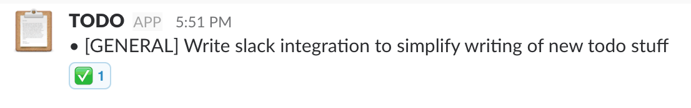

# SlackDO [](https://badge.fury.io/rb/slackdo)



SlackDO is a simple CLI tool that allows you to send TODO items and reminders to a channel on Slack or to yourself. It simplifies the process of maintaining your TODO list from the CLI without having to leave it.

## Prerequisites
- Ruby
- [Slack Incoming Webhook](https://my.slack.com/services/new/incoming-webhook)
  - Configure the webhook to your liking and either point the webhook to yourself or a separate todo channel

## Installation
```
gem install slackdo
```

In order to use slackdo you still have to add the rubygem's bin location to your $PATH.

```bash
export PATH=$PATH:$(gem which slackdo | rev | cut -d'/' -f3- | rev)/bin
```

## Usage


For more information see `slackdo help`.

### Configuring Slack
You should start with configuring your slack [webhook](https://my.slack.com/services/new/incoming-webhook):

```bash
slackdo configure slack
```

### Adding a new category
Categories are what you tag your message as. To create a new category use:

```bash
slackdo category add
```

### Writing a new item
Simply use:

```bash
slackdo task
```

### Trello
To start using the Trello integration of SlackDO, which enables you to push your TODO items to a list on Trello, use:

```
slackdo configure trello
```

Now that this has been configured SlackDO will send your items to both Slack and Trello everytime you create a new task.

You can add your label ids to the configuration to enable SlackDO to automatically assign labels to your cards. You can add or remove a label by doing the following:

```
slackdo label add
slackdo label remove
```

SlackDO will look for labels that have the same name as the category you have selected for your new task.
So for example if you create a task with the category set to `GENERAL` SlackDO will look for a label with name `GENERAL`.

To disable the Trello integration again use:

```
slackdo disable trello
```

#### Chrome extensions
When you decide on using labels to add flair to your Trello cards I suggest taking a look at the following Chrome extensions:  
- [Card Color Titles for Trello](https://chrome.google.com/webstore/detail/card-color-titles-for-tre/hpmobkglehhleflhaefmfajhbdnjmgim?hl=en)
- [Card Colors for Trello](https://chrome.google.com/webstore/detail/card-colors-for-trello/nodlpencjjlohojddhflnahnfpfanbjm?hl=en)

### Configuration
The config file is located at `~/.slackdo/config.json` if you like to change things manually.

## Development
Slackdo is still under development and might still be buggy. Feel free to contribute to the project.

## Contributing
Bug reports and pull requests are welcome on GitHub at https://github.com/segersniels/slackdo.

## License
The gem is available as open source under the terms of the [MIT License](https://opensource.org/licenses/MIT).
