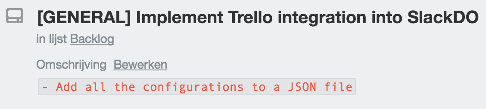

# Slackdo [](https://badge.fury.io/rb/slackdo)


SlackDO is a simple CLI tool that allows you to send TODO items and reminders to a channel on Slack or to yourself. It simplifies the process of maintaining your TODO list from the CLI without having to leave it.

## Prerequisites
- Ruby
- [Slack Incoming Webhook](https://my.slack.com/services/new/incoming-webhook)
  - Configure the webhook to your liking and either point the webhook to yourself or a separate todo channel

## Installation
```
gem install slackdo
```

In order to use slackdo you still have to add the rubygem's bin location to your $PATH.

```bash
export PATH=$PATH:$(gem which slackdo | rev | cut -d'/' -f3- | rev)/bin
```

## Usage
### Slack
First thing you should do is configure your incoming webhook by doing the following:

```
slackdo configure slack
```

After that you're all set to go.
Add a new TODO item by using

```ruby
slackdo task
```
or add a reminder with

```ruby
slackdo reminder
```

### Trello
To start using the Trello integration of SlackDO, which enables you to push your TODO items to a list on Trello, use:

```
slackdo configure trello
```

Now that this has been configured SlackDO will send your items to both Slack and Trello everytime you use the command:

```
slackdo task
```



You can add your label ids to the configuration to enable SlackDO to automatically assign labels to your cards. You can do this by doing the following:

```
slackdo label add
```

Just make sure you name your labels on Trello the same as the categories you use for your SlackDO tasks, otherwise it won't find these labels. So for example if you create a task with category set to `GENERAL` it will search for a label with a name set to `GENERAL` as well.

To disable the Trello integration again use:

```
slackdo disable trello
```


### Configuration
The config file is located at `~/.slackdo/config.json` if you like to change things manually.

## Development
Slackdo is still under development and might still be buggy. Feel free to contribute to the project.

## Contributing
Bug reports and pull requests are welcome on GitHub at https://github.com/segersniels/slackdo.

## License
The gem is available as open source under the terms of the [MIT License](https://opensource.org/licenses/MIT).
